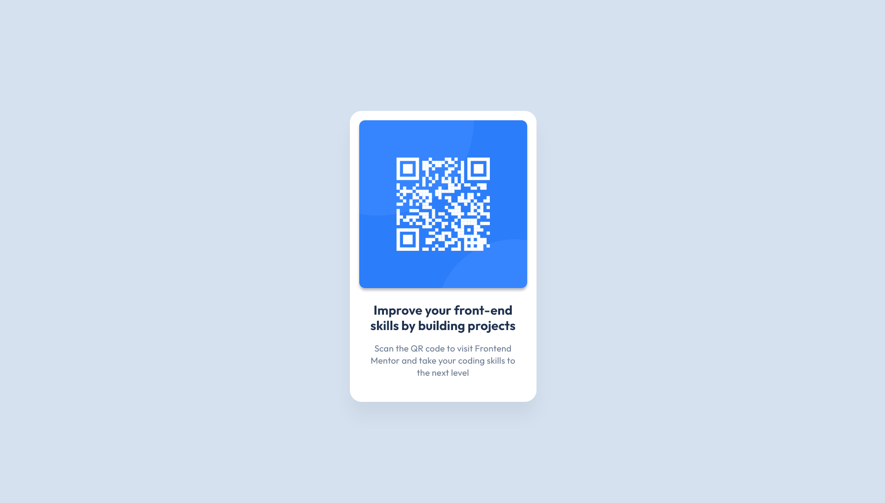

# QR Code Component - Frontend Mentor Challenge

This is a solution to the [QR Code Component challenge on Frontend Mentor](https://www.frontendmentor.io/challenges/qr-code-component-iux_sIO_H). 
Frontend Mentor challenges help you improve your coding skills by building realistic projects.

## Overview

### The Challenge

Your challenge is to build out this QR code component and get it looking as close to the design as possible.

Users should be able to:

- View the optimal layout depending on their device's screen size.
- See hover states for interactive elements.

### Screenshot

Add a screenshot of your solution here.



## Getting Started

To get a local copy up and running, follow these steps:

### Prerequisites

You'll need a basic understanding of HTML and CSS.

### Installation

1. Clone the repository:

   ```bash
   git clone https://github.com/ChihaAdam/qr-code-component.git
   cd qr-code-component
   ```

2. Open `index.html` in your browser to view the project.

## Deployment

This project can be deployed using services like [GitHub Pages](https://pages.github.com/), [Vercel](https://vercel.com/), or [Netlify](https://www.netlify.com/).

## Built With

- Semantic HTML5 markup
- CSS custom properties
- Flexbox

## Acknowledgments

Thanks to [Frontend Mentor](https://www.frontendmentor.io) for the design inspiration.

